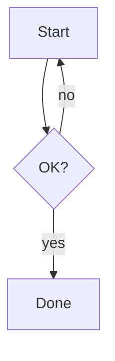
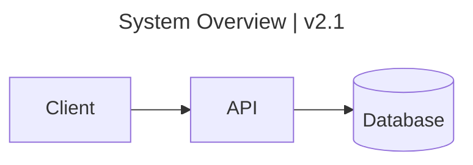

# mdtohtml

A self-contained command-line tool that converts Obsidian-compatible Markdown
into styled, standalone HTML.

[](https://github.com/MatLomax/mdtohtml/actions/workflows/build.yml)
[](https://github.com/MatLomax/mdtohtml/actions/workflows/test.yml)

## Features

- **Single self-contained binary.** No server, no API, no network call, and
  no Node.js or Python required at runtime once built.
- **Obsidian-compatible Markdown**: callouts (`> [!note]`), wikilinks
  (`[[Page]]`, resolved to the `.html` sibling of each page), task lists,
  tables, footnotes, syntax highlighting, `~~del~~`, `==mark==`, and an
  optional table-of-contents sidebar.
- **Themeable** via drop-in CSS files — add a theme without rebuilding
  anything. Ships a `report` theme (a warm, AA-accessible, auto light/dark
  visual system) alongside `default`, `dark`, and `print`.
- **Coloured chips.** Inline `:blue[label]` syntax renders a categorical pill
  (`<span class="pchip blue">`) in any of 11 palette colours, styled by the
  `report` theme.
- **Pre-rendered math.** LaTeX math is typeset to static markup at convert
  time by a bundled KaTeX; the output carries the KaTeX stylesheet and fonts
  (base64-inlined) but no JavaScript engine, and only when a document actually
  contains math, so a math-free document ships zero KaTeX bytes.
- **Pre-rendered diagrams.** A ` ```mermaid ` fenced block is rendered to
  inline SVG at convert time, so diagrams need no runtime JavaScript and no
  network call.
- **Self-contained images.** An image embedded as a `data:` URI is preserved,
  so a picture ships inside the HTML with no separate asset or network fetch.
  For safety a `data:` URI is accepted only as an image source and only for
  image MIME types; every other `data:` payload is stripped.
- **Single-file output.** Each converted document is one portable,
  self-contained HTML file.

## Install

**Download a release.** Grab the zip for your platform from the
[Releases](https://github.com/MatLomax/mdtohtml/releases) page and extract
it as-is — the executable and its `themes/` folder must sit side by side:

```
/somewhere/
  mdtohtml
  themes/
    default.css
    dark.css
    print.css
```

Running the bare executable with no `themes/` folder next to it (or an empty
one) fails with a clear error instead of converting anything.

**Or build from source** — see [Building binaries](#building-binaries)
below.

## Usage

```bash
# Convert one file to stdout
mdtohtml notes.md > notes.html

# Convert to a specific file
mdtohtml notes.md -o notes.html

# Convert several files into a directory (one .html per input)
mdtohtml *.md -o out/

# Pick a theme and add a table-of-contents sidebar
mdtohtml notes.md --theme dark --toc -o notes.html

# Drop callouts of a given type
mdtohtml notes.md --ignore "info,tip" -o notes.html

# Point at a themes folder kept elsewhere
mdtohtml notes.md --themes-dir /path/to/themes -o notes.html
```

Run `mdtohtml --help` for the full flag list.

## Themes

Themes are plain CSS files. To add or customize one, drop a `.css` file into
the `themes/` folder next to the binary:

```
/somewhere/
  mdtohtml
  themes/
    default.css
    dark.css
    print.css
    mytheme.css
```

Then `mdtohtml notes.md --theme mytheme -o out.html` uses it — no rebuild
needed. A `--themes-dir` flag can also point at a themes folder kept
elsewhere.

The built-in `report` theme (`--theme report`) is a warm, AA-accessible
visual system that auto-switches light/dark with the reader's
`prefers-color-scheme`, styling headings, tables, callout cards, coloured
chips, framed diagrams, and a front-matter-driven hero as a cohesive report.

### Chips

Inline `:key[label]` renders a coloured category pill, where `key` is one of
the 11 palette colours (`blue`, `green`, `amber`, `purple`, `teal`, `pink`,
`lime`, `gold`, `slate`, `red`, `gray`):

```markdown
Status :green[passing] · :red[blocked] · :slate[deferred]
```

A colon that is not one of these keys, or one glued to a preceding word
(`code:red[1]`), is left as ordinary text. Chips carry a `pchip` class and are
styled by the `report` theme; under other themes the label shows as plain text.

### Front matter and the report hero

A document may open with a `---` fenced front-matter block that supplies the
report hero — the header band the `report` theme renders above the content:

```markdown
---
eyebrow: mdtohtml · component reference
title: A Field Guide to mdtohtml
lede: A one-paragraph intro that may contain **inline markdown**.
slot: Shipped | Server-side rendering | Zero runtime JavaScript.
slot: Themed | Report theme | Auto light/dark, AA-safe.
slot: Portable | Single file | Everything inlines into one HTML file.
---

## First section
```

- `title` sets both the hero `<h1>` and the document `<title>`; when a document
  uses front matter its body should start at `##`, since the hero supplies the
  heading.
- `eyebrow` is a small mono kicker above the title; `lede` is the oversized
  intro line.
- Each `slot:` line is one card in the hero's slot rail, split on `|` into
  `label | heading | body` (three cards read best; they stack on narrow
  screens). `label` is a plain mono kicker; `lede`, slot `heading`, and slot
  `body` accept inline markdown.

The block is a tiny flat format with no bundled YAML dependency; unrecognised
keys are ignored. Author text is escaped or sanitized, so nothing in the hero
can inject markup. A document without a leading `---` block is unaffected, and
the hero markup is styled only by the `report` theme (other themes leave it
unstyled, as with chips).

## Math

Math is written as standard LaTeX delimiters (`$inline$` and `$$display$$`)
and typeset to static HTML at convert time by a bundled
[KaTeX](https://katex.org/) run in an embedded JavaScript engine. The output
carries only the KaTeX stylesheet (fonts inlined as base64 data URIs) needed
to display that markup — no KaTeX engine or client-side script ships in the
page. The stylesheet is injected into the output `<head>` only when a document
actually contains math, so a document without math carries zero KaTeX bytes.

A malformed expression renders as a visible KaTeX error rather than aborting
the conversion.

KaTeX's code is MIT-licensed (Copyright (c) 2013-2020 Khan Academy and other
contributors); its fonts are licensed under the SIL Open Font License 1.1
(Copyright (c) 2009-2010 Design Science, Inc.; Copyright (c) 2014-2018 Khan
Academy). Both licenses ship in the bundle: `mdtohtml/katex/LICENSE` (MIT) and
`mdtohtml/katex/OFL.txt` (OFL).

## Diagrams

A fenced code block tagged `mermaid` is pre-rendered to inline SVG at convert
time using [`mermaidx`](https://pypi.org/project/mermaidx/) (mermaid.js run in
an embedded engine), so diagrams display with no runtime JavaScript and no
network call:

````markdown

````

Diagrams render with the `dark` mermaid theme under the `dark` theme and the
default palette otherwise. A diagram that fails to parse degrades to its
original source shown as a code block with a visible note, so one bad diagram
never breaks the document.

A `title:` in a diagram's mermaid front matter is lifted out of the canvas into
a styled header bar on the `report` theme's diagram card (other themes leave it
unstyled). A `left | right` title splits into a left-aligned label and a
right-aligned meta note:

````markdown

````

## Third-party licenses

mdtohtml is MIT-licensed and relies on several third-party components. The
[`THIRD-PARTY-LICENSES`](THIRD-PARTY-LICENSES) aggregate collects the license
and copyright notices for the components embedded in the frozen binary and the
release zip that ships to users. The Python wheel embeds only KaTeX and declares
the rest as ordinary pip dependencies, each installed with its own license
notices. The aggregate covers:

- [mermaidx](https://github.com/mohammadraziei/mermaidx) (MIT) and the bundled
  [mermaid.js](https://github.com/mermaid-js/mermaid) 11.16.0 (MIT) diagram
  engine.
- [quickjs-ng](https://github.com/quickjs-ng/quickjs) (MIT) -- the JavaScript
  engine behind both math and diagram rendering.
- [resvg_py](https://github.com/baseplate-admin/resvg-py) (MIT), whose native
  library statically links the [resvg](https://github.com/RazrFalcon/resvg) SVG
  engine (dual `MIT OR Apache-2.0`; mdtohtml elects MIT). All of its bundled
  Rust crates are permissively licensed -- none is MPL or copyleft.
- DejaVu Sans fonts (Bitstream Vera license) bundled by mermaidx for text
  metrics.
- KaTeX code (MIT) and KaTeX fonts (SIL OFL 1.1), whose full texts also ship at
  `mdtohtml/katex/LICENSE` and `mdtohtml/katex/OFL.txt`.
- the Python-Markdown (BSD-3-Clause), pymdown-extensions (MIT), Pygments
  (BSD-2-Clause), nh3 (MIT), and termaid (MIT) libraries.
- the CPython runtime (PSF License) and the PyInstaller bootloader
  (GPL-2.0-or-later with a bootloader exception permitting the frozen binary to
  ship under mdtohtml's own terms), both embedded only in the frozen binary. See
  [`THIRD-PARTY-LICENSES`](THIRD-PARTY-LICENSES) for the full texts.

## How it works

0. A leading `---` front-matter block, if present, is split off to build the
   report hero and set the document `<title>`; the rest is the markdown body.
1. Markdown (with Obsidian callouts and wikilinks preprocessed) is converted
   to HTML via `markdown` + `pymdown-extensions`; ` ```mermaid ` fences render
   to inline SVG, held aside behind a placeholder.
2. Math is pre-rendered to static KaTeX markup.
3. The output is sanitized with [`nh3`](https://github.com/messense/nh3), then
   the trusted diagram SVG is restored in place of its placeholder (it carries
   a load-bearing `<style>` block the sanitizer would otherwise strip).
4. The sanitized body is wrapped in an HTML template with the chosen theme's
   CSS inlined, plus the KaTeX stylesheet when the document contains math.

No `weasyprint`, no headless browser, no PDF path — HTML is the only output
format.

## Known limitations

- **Nested callouts** (`> > [!warning]` inside another callout) and lazy
  (unindented) callout continuation lines are not converted; use a single
  level of `> [!type]` blocks.

## Development

```bash
python -m venv .venv
.venv/bin/pip install -e '.[build]'
.venv/bin/python -m pytest -q
```

## Regenerating KaTeX assets

The vendored KaTeX bundle under `mdtohtml/katex/` is checked in, so most contributors
never need to touch this. To regenerate it (e.g. to bump the KaTeX version):

```bash
npm install
python scripts/build_katex_assets.py
```

`npm`/Node.js is used **only** to fetch the `katex` package as a source for
this script — it is not required to build, test, or run `mdtohtml` itself.
The script reads `node_modules/katex/dist`, inlines its fonts as base64 data
URIs into `katex.min.css`, and writes the result into `mdtohtml/katex/`.

## Building binaries

The build produces a single self-contained executable (no Python required to
run it). PyInstaller is the only extra build dependency.

```bash
pip install -e '.[build]'
scripts/build_binary.sh
```

`scripts/build_binary.sh` wipes `build/` and `dist/`, runs PyInstaller against
`mdtohtml.spec` (onefile), and then assembles the release zip that ships to
users: `dist/mdtohtml-linux-x86_64.zip` (or `dist/mdtohtml-windows-x86_64.zip`
on Windows), containing the executable, a `themes/` folder, and the `LICENSE`
and `THIRD-PARTY-LICENSES` files side by side. Theme CSS is **not** baked into
the executable — only the KaTeX and mermaid rendering assets (and the engines
that drive them) are — so the `themes/` folder must travel with the binary.

The Linux binary is dynamically linked against the glibc of the machine that
built it, so it runs on that glibc version or newer. It does not run on musl
systems (e.g. Alpine). To target older distros, build inside a manylinux
container; for musl, build on the target musl system.

Cross-compilation is not possible with PyInstaller, so the Windows binary is
built on Windows. `.github/workflows/build.yml` builds and smoke-tests the
binary on both `ubuntu-latest` and `windows-latest` and uploads the zipped
binary + `themes/` as an artifact for each.

## License

[MIT](LICENSE) (c) Mathieu Lomax
