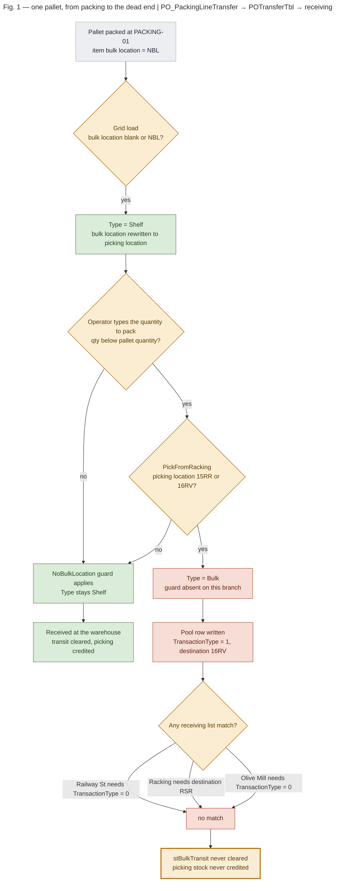

^ The symptom
## What ST_Enquiry is reporting

The Information tab reads three transit buckets off `ST_Stock` — `stShelfTransit` (Packing to Picking), `stBulkTransit` (Packing to Bulk) and `stBSTransit` (Bulk to Picking). Both reported items carry their whole balance in `stBulkTransit`.

{.keyed}
| Stock code | Picking loc | Bulk loc | stBulkTransit | stShelfTransit | stBSTransit | Picking stock |
|------------|-------------|----------|---------------|----------------|-------------|---------------|
| CCOBLALA | 16RV | NBL | 73 | 0 | 0 | 3 |
| CCSLBLALA6 | 16RV | NBL | 15 | 0 | 0 | :red{-7} |

Those figures are not corrupt. They reconcile exactly to open pallets in `POTransferTbl` — CCOBLALA to P402688 (23) + P406480 (12) + P410265 (15) + P417980 (11) + P418079 (12) = 73, and CCSLBLALA6 to P414500 (9) + P417955 (6) = 15. Every one of those pallets is `PalletStatus = 2` (in transit) with a null `TransferTime` and no `ReceivedBy`: packed by `ligpack1` at PACKING-01, never received.

> [!note] Why picking stock goes negative
> **The receipt is what credits picking stock.** `PackingViewModel` in `PO_PickingTransfer` clears the transit bucket and calls `AllocateLocationStock` in the same step. With the receipt never running, sales keep deducting from picking stock while the units that should have replenished it sit in transit — so the count drifts below zero and stays there.

^ The trigger
## Both items moved to picking location 16RV

The movement audit in `ST_MovementTbl` records the picking location on every row, so the change is datable. Before it, every packing transfer for these items completed within the hour; after it, none ever completed.

{.keyed}
| Stock code | Picking loc | Period | Transfers completed |
|------------|-------------|--------|---------------------|
| CCOBLALA | 01ON | 2023-07-27 → 2024-06-25 | :green{yes — P362394 received at OLIVEWAR-01} |
| CCOBLALA | 16RV | 2024-07-16 → current | :red{no — 5 pallets stranded} |
| CCSLBLALA6 | 01AD | 2023-07-28 → 2025-11-03 | :green{yes — P362450, P403346, P410268 all received} |
| CCSLBLALA6 | 16RV | 2025-11-26 → current | :red{no — 2 pallets stranded} |

CCSLBLALA6's last successful transfer, P410268, is the same day as its last `01AD` movement row. Nothing about the items themselves changed — only where they are picked from.

^ Root cause
## The no-bulk-location rule was missing from the quantity path

Both items have **no bulk location**: `stbulklocation = 'NBL'`. `MainWnd.LoadGrid` handles that correctly — when the bulk location is blank or `NBL` it rewrites `location.BulkLocation` to the picking location and forces `location.Type = Shelf`. But `location.Type` is recomputed on *every* quantity edit, and the branch that fires here dropped the guard.

```{.csharp title="Before the fix — the QtyToPack branch | PO_PackingLineTransfer · MainWnd.grid_OnCanEndEdit" hl_lines="6 7"}
if (qty < pallQty)
{
    location.Type = POTransferTbl.TransactionType.Shelf;

    // Remove 18MMOY and 18MMKA  All carcase stock picked from GM forced to RS - space issue at GM - ML / JW
    if (location.PickFromRacking || (StockTable.Alpha == "18MMKA" || StockTable.Alpha == "18MMOY"))
        location.Type = POTransferTbl.TransactionType.Bulk;   // no NoBulkLocation check
}
else
{
    if (location.NoBulkLocation)                               // the guard, only on this branch
        location.Type = POTransferTbl.TransactionType.Shelf;
    else
        location.Type = POTransferTbl.TransactionType.Bulk;
}
```
~ StockLocation.PickFromRacking is hardcoded ShelfLocation == "15RR" || ShelfLocation == "16RV".

`qty < pallQty` is always the branch taken for these items: pallet quantities are 90 and 50, while the packed quantities were 6, 9, 11, 12, 15 and 23. So `16RV` forced `Bulk` every time, for an item with nowhere bulk to go. `Type` then does two things at Confirm — it selects the bucket (`BulkTransit += qtp` instead of `ShelfTransit`) and it is written as the pool row's `TransactionType`.

The same omission was present in three further paths, and in the post-confirm recompute the guard was present but applied *before* `PickFromRacking`, so it was overridden anyway:

{.keyed}
| Decision site | Symbol | Guard before | Guard after |
|---------------|--------|--------------|-------------|
| Grid load | `MainWnd.LoadGrid` | :green{present} | :green{present, plus the shared rule} |
| Quantity to pack | `MainWnd.grid_OnCanEndEdit` | :red{absent} | :green{applied last} |
| Pallet quantity | `MainWnd.grid_OnCanEndEdit` | :red{absent} | :green{applied last} |
| Location override | `MainWnd.grid_OnCanEndEdit` | :red{absent} | :green{applied last} |
| Post-confirm | `MainWnd.grid_OnCellHit` | :red{overridden} | :green{applied last} |

^ The dead end
## Why nothing can ever clear it

The pallet lands with `TransactionType = 1` (Bulk) and `PalletDestination = '16RV'` — a *bulk* transfer addressed to a *picking* location. Every receiving list rules it out.

```{.csharp title="The receiving filters | JJO.DataObjects · POTransferTbl.FromPacking and LoadPalletsForRacking" hl_lines="2 9"}
case ST_Stock.AreaCode.RailwaySt:
    "(PalletStatus = 2 OR PalletStatus = 1) and (SubString(PickingLocation,3,4) in ('AC','RV','RX','RR') and TransactionType = 0)"
case ST_Stock.AreaCode.OliveMill:
    "PalletStatus = 2 and (SubString(PickingLocation,3,4) in ('AB','AD','OO','X1','X2','OM','ON','AE') and TransactionType = 0)"
case ST_Stock.AreaCode.SprayShop:
    "PalletStatus = 2 and ((PalletDestination = 'FMB' and TransactionType = 1) or (PickingLocation = '20FM' and TransactionType = 0))"

// LoadPalletsForRacking
    "TransactionType = 1 and PalletDestination = 'RSR' and PalletStatus = 2"
```
~ Railway St matches the location but demands TransactionType = 0; racking takes TransactionType = 1 but only for destination RSR.

{.keyed}
| Receiving list | Consumer | What it needs | Matches? |
|----------------|----------|---------------|----------|
| Railway St | `PO_PickingTransfer` | Location suffix RV — **and TransactionType = 0** | :red{no} |
| Olive Mill | `PO_PickingTransfer` | Location suffix AB/AD/ON/… and TransactionType = 0 | :red{no} |
| Racking | `ST_Racking` | TransactionType = 1 — **and destination RSR** | :red{no} |
| Spray Shop | `PO_PickingTransfer` | Destination FMB, or location 20FM | :red{no} |
| Green Acre | `PO_PickingTransfer` | Destination GMX, or location suffix GS/X3/GM | :red{no} |
| Bathrooms | `PO_PickingTransfer` | Location 50EB | :red{no} |
| Victoria Works | `PO_PickingTransfer` | Location 18VW/00VW/60VW, or destination VWX | :red{no} |


~ Green is the working path; rust is the stranded one. The single amber-bordered node is the state the two reported items are in.

^ The code fix
## One rule, applied last at every decision site

Four copies of a subtly different rule is what caused this, so the fix states the invariant once, on `StockLocation`, and calls it as the final step of every `Type` decision — after the racking and alpha-code rules, so nothing can override it.

```{.csharp title="After the fix — the shared rule | PO_PackingLineTransfer · StockLocation.ApplyNoBulkLocationRule" hl_lines="12 13"}
/// <summary>
/// Forces a Shelf transfer for an item that has no bulk location of its own. Runs as
/// the last step of every <see cref="Type"/> decision, after the racking and
/// alpha-code rules: an item whose bulk location is blank or NBL has nowhere bulk to
/// be received into, so a Bulk transfer for it matches no warehouse receiving list
/// and can never be completed. Its quantity stays in stBulkTransit indefinitely
/// while picking stock runs negative against it.
/// </summary>
public void ApplyNoBulkLocationRule()
{
    if (NoBulkLocation)
        Type = POTransferTbl.TransactionType.Shelf;
}
```

> [!note] Why the grid-load path is guarded too, when its own check already covers NBL
> **`NoBulkLocation` is broader than the blank-or-NBL test.** It is `BulkLocation == ShelfLocation`, which is also true of a stock record whose bulk location genuinely equals its picking location. No item is set that way today (verified: zero rows in `ST_Stock`), but nothing prevents one, and that path would strand a pallet exactly as before. The rule is applied there as well rather than relying on today's data.

{.keyed}
| File | Change | Reason |
|------|--------|--------|
| MainWnd.cs | `ApplyNoBulkLocationRule` added to `StockLocation`, called at all five sites | The defect |
| Program.cs | `AppLog.Start` / `AppLog.Shutdown` replace the hand-rolled logger factory | AppLogger ratchet |
| PO_PackingLineTransfer.csproj | Publish target reduced to the convention — condition and echo banner dropped | csproj ratchet |

> [!note] The two other ratchets were already met
> Version tags read `1.26.2.7` / `1.26.2.7` / `1.26.2` against branch `releases/1.26.2.7`, and every `HintPath` is already relative. The `Program.cs` swap is not cosmetic: the previous code called `Directory.CreateDirectory` on the log share at startup — so an unreachable share cost the app's launch, not just its log lines — and it disposed only the logger factory, never the provider, which is what actually drains the queue to disk. The tail of every log was being lost.

^ Scale
## Not two codes — 24

The two reported items are the visible corner of a class fault. Selecting every open pallet with `TransactionType = 1` whose destination is not a real bulk location returns **48 pallets, 24 stock codes, 369 units**, oldest packed 2023-09-14 and newest 2026-08-18. Every one of the 48 is against a stock record with `stbulklocation = 'NBL'` — the signature of this defect and no other.

{.keyed}
| Trigger | Clause | Pallets | Codes | Units |
|---------|--------|---------|-------|-------|
| PickFromRacking | Picking location `16RV` or `15RR` | 35 | 20 | 337 |
| Alpha force | Alpha `18MMKA` or `18MMOY` at `01AD` | 13 | 4 | 32 |
| Total | — | 48 | 24 | 369 |

Both triggers are the same line of code — the `if` that forces `Bulk` in the `QtyToPack` branch. The alpha-code clause was added for the carcase stock moved off Green Acre, and it strands a pallet for the same reason the racking clause does.

^ Data correction — for sign-off
## Per stock code

For every one of the 24 codes the stranded pallet quantities sum to **exactly** the `stBulkTransit` the stock record carries — nothing unexplained, so the correction is fully determined by the pallet list. `stShelfTransit` and `stBSTransit` are zero for all 24 and are not touched.

{.keyed}
| Stock code | Pallets | Stranded qty | stBulkTransit | Reconciles | Picking now | Picking after |
|------------|---------|--------------|---------------|------------|-------------|---------------|
| CCCWBGDG | 1 | 8 | 8 | :green{balances} | 6 | 14 |
| CCCWBTB | 1 | 4 | 4 | :green{balances} | :red{-2} | 2 |
| CCDHO5 | 1 | 4 | 4 | :green{balances} | :red{-4} | 0 |
| CCDLBKA6 | 5 | 18 | 18 | :green{balances} | 4 | 22 |
| CCDLBKA8 | 2 | 4 | 4 | :green{balances} | 0 | 4 |
| CCDLBOY6 | 3 | 6 | 6 | :green{balances} | :red{-2} | 4 |
| CCDLBOY8 | 3 | 4 | 4 | :green{balances} | :red{-2} | 2 |
| CCMDBLAM10 | 4 | 15 | 15 | :green{balances} | :red{-8} | 7 |
| CCMDBLAM4 | 1 | 17 | 17 | :green{balances} | :red{-1} | 16 |
| CCMDBLAM5 | 2 | 23 | 23 | :green{balances} | :red{-10} | 13 |
| CCMDBLAM6 | 4 | 40 | 40 | :green{balances} | :red{-27} | 13 |
| CCMDBLAM7 | 2 | 10 | 10 | :green{balances} | :red{-2} | 8 |
| CCMDBLAM8 | 1 | 1 | 1 | :green{balances} | 4 | 5 |
| CCMDBLAM9 | 2 | 10 | 10 | :green{balances} | 2 | 12 |
| CCMEGDG | 1 | 10 | 10 | :green{balances} | 8 | 18 |
| CCMEHO | 1 | 3 | 3 | :green{balances} | :red{-3} | 0 |
| CCOBLALA | 5 | 73 | 73 | :green{balances} | 3 | 76 |
| CCRBRGDG | 1 | 4 | 4 | :green{balances} | 11 | 15 |
| CCRWETB | 2 | 35 | 35 | :green{balances} | :red{-19} | 16 |
| CCSLBLALA6 | 2 | 15 | 15 | :green{balances} | :red{-7} | 8 |
| CCSTLBLALA4 | 1 | 5 | 5 | :green{balances} | 1 | 6 |
| CCTCWBTB | 1 | 6 | 6 | :green{balances} | :red{-1} | 5 |
| CCTRWEGDG | 1 | 36 | 36 | :green{balances} | 25 | 61 |
| CCTRWETB | 1 | 18 | 18 | :green{balances} | :red{-8} | 10 |

> [!keypoint]
> The correction moves 369 units out of transit and into picking stock. It clears the phantom transit and, as a direct consequence, brings every negative picking count back to zero or above.
>
> > 14 of the 24 codes are currently negative on picking stock; after the correction, none are.

^ Data correction — for sign-off
## Per pallet

All 48 rows are `PalletStatus = 2`, packed by `ligpack1`. Pallet destination equals the picking location on every row, which is the rewrite the grid-load path performs for an `NBL` item.

{.keyed}
| Stock code | Description | Alpha | Pallet | PO | Qty | Packed | Picking loc | Bulk loc |
|------------|-------------|-------|--------|-----|-----|--------|-------------|----------|
| CCCWBGDG | CORNER WALL BLANK PANEL GLOSS DAKOTA GRE | 18MMGDG | P376000 | BM4556 | 8 | 2024-03-14 | 16RV | NBL |
| CCCWBTB | CORNER WALL BLANK PANEL TYROLEAN BLUE | 18MMTB | P377972 | BM4572 | 4 | 2024-04-23 | 16RV | NBL |
| CCDHO5 | 500 DRESSER CARCASE HALIFAX OAK | 18MMHO | P415775 | AK7260 | 4 | 2026-03-04 | 15RR | NBL |
| CCDLBKA6 | 600 DIAGONAL LARDER BACK KASHMIR | 18MMKA | P364662 | AK5404 | 4 | 2023-09-14 | 01AD | NBL |
| CCDLBKA6 | 600 DIAGONAL LARDER BACK KASHMIR | 18MMKA | P375816 | AK5741 | 2 | 2024-03-12 | 01AD | NBL |
| CCDLBKA6 | 600 DIAGONAL LARDER BACK KASHMIR | 18MMKA | P402462 | AK6670 | 4 | 2025-06-15 | 01AD | NBL |
| CCDLBKA6 | 600 DIAGONAL LARDER BACK KASHMIR | 18MMKA | P409302 | AK7017 | 3 | 2025-10-15 | 01AD | NBL |
| CCDLBKA6 | 600 DIAGONAL LARDER BACK KASHMIR | 18MMKA | P412774 | AK7130 | 5 | 2025-12-16 | 01AD | NBL |
| CCDLBKA8 | 800 DIAGONAL LARDER BACK KASHMIR | 18MMKA | P375842 | AK5741 | 2 | 2024-03-12 | 01AD | NBL |
| CCDLBKA8 | 800 DIAGONAL LARDER BACK KASHMIR | 18MMKA | P385471 | AK6083 | 2 | 2024-08-19 | 01AD | NBL |
| CCDLBOY6 | 600 DIAGONAL LARDER BACK OYSTER | 18MMOY | P375812 | AK5741 | 2 | 2024-03-12 | 01AD | NBL |
| CCDLBOY6 | 600 DIAGONAL LARDER BACK OYSTER | 18MMOY | P375916 | AK5813 | 2 | 2024-03-13 | 01AD | NBL |
| CCDLBOY6 | 600 DIAGONAL LARDER BACK OYSTER | 18MMOY | P412775 | AK7130 | 2 | 2025-12-16 | 01AD | NBL |
| CCDLBOY8 | 800 DIAGONAL LARDER BACK OYSTER | 18MMOY | P382747 | AK5948 | 2 | 2024-07-07 | 01AD | NBL |
| CCDLBOY8 | 800 DIAGONAL LARDER BACK OYSTER | 18MMOY | P385473 | AK6083 | 1 | 2024-08-19 | 01AD | NBL |
| CCDLBOY8 | 800 DIAGONAL LARDER BACK OYSTER | 18MMOY | P412779 | AK7130 | 1 | 2025-12-16 | 01AD | NBL |
| CCMDBLAM10 | 1000 MULTI DRAWER BASE LAVA MERIVO | 18MMLA | P401062 | AK6648 | 4 | 2025-05-27 | 16RV | NBL |
| CCMDBLAM10 | 1000 MULTI DRAWER BASE LAVA MERIVO | 18MMLA | P407368 | AK6907 | 6 | 2025-09-10 | 16RV | NBL |
| CCMDBLAM10 | 1000 MULTI DRAWER BASE LAVA MERIVO | 18MMLA | P416158 | AK7267 | 1 | 2026-03-10 | 16RV | NBL |
| CCMDBLAM10 | 1000 MULTI DRAWER BASE LAVA MERIVO | 18MMLA | P422576 | AK7513 | 4 | 2026-06-29 | 16RV | NBL |
| CCMDBLAM4 | 400 MULTI DRAWER BASE LAVA MERIVO | 18MMLA | P422562 | AK7513 | 17 | 2026-06-29 | 16RV | NBL |
| CCMDBLAM5 | 500 MULTI DRAWER BASE LAVA MERIVO | 18MMLA | P404034 | AK6823 | 13 | 2025-07-07 | 16RV | NBL |
| CCMDBLAM5 | 500 MULTI DRAWER BASE LAVA MERIVO | 18MMLA | P425232 | AK7635 | 10 | 2026-08-18 | 16RV | NBL |
| CCMDBLAM6 | 600 MULTI DRAWER BASE LAVA MERIVO | 18MMLA | P392038 | AK6360 | 5 | 2024-12-02 | 16RV | NBL |
| CCMDBLAM6 | 600 MULTI DRAWER BASE LAVA MERIVO | 18MMLA | P404035 | AK6823 | 12 | 2025-07-07 | 16RV | NBL |
| CCMDBLAM6 | 600 MULTI DRAWER BASE LAVA MERIVO | 18MMLA | P416152 | AK7267 | 11 | 2026-03-10 | 16RV | NBL |
| CCMDBLAM6 | 600 MULTI DRAWER BASE LAVA MERIVO | 18MMLA | P422564 | AK7513 | 12 | 2026-06-29 | 16RV | NBL |
| CCMDBLAM7 | 700 MULTI DRAWER BASE LAVA MERIVO | 18MMLA | P404044 | AK6823 | 8 | 2025-07-07 | 16RV | NBL |
| CCMDBLAM7 | 700 MULTI DRAWER BASE LAVA MERIVO | 18MMLA | P404047 | AK6823 | 2 | 2025-07-07 | 16RV | NBL |
| CCMDBLAM8 | 800 MULTI DRAWER BASE LAVA MERIVO | 18MMLA | P401060 | AK6648 | 1 | 2025-05-27 | 16RV | NBL |
| CCMDBLAM9 | 900 MULTI DRAWER BASE LAVA MERIVO | 18MMLA | P392035 | AK6360 | 8 | 2024-12-02 | 16RV | NBL |
| CCMDBLAM9 | 900 MULTI DRAWER BASE LAVA MERIVO | 18MMLA | P392036 | AK6360 | 2 | 2024-12-02 | 16RV | NBL |
| CCMEGDG | MIDI END PANELS GLOSS DAKOTA GREY | 18MMGDG | P371289 | AK5663 | 10 | 2023-12-16 | 16RV | NBL |
| CCMEHO | MIDI HOUSING END PANELS HALIFAX OAK | 18MMHO | P408629 | AK7009 | 3 | 2025-10-03 | 15RR | NBL |
| CCOBLALA | 600 OVEN BACK LAVA / LAVA | 18MMBACKS | P402688 | EK1322 | 23 | 2025-06-19 | 16RV | NBL |
| CCOBLALA | 600 OVEN BACK LAVA / LAVA | 18MMBACKS | P406480 | EK1364 | 12 | 2025-08-21 | 16RV | NBL |
| CCOBLALA | 600 OVEN BACK LAVA / LAVA | 18MMBACKS | P410265 | EK1390 | 15 | 2025-11-03 | 16RV | NBL |
| CCOBLALA | 600 OVEN BACK LAVA / LAVA | 18MMBACKS | P417980 | EK1560 | 11 | 2026-04-13 | 16RV | NBL |
| CCOBLALA | 600 OVEN BACK LAVA / LAVA | 18MMBACKS | P418079 | EK1560 | 12 | 2026-04-15 | 16RV | NBL |
| CCRBRGDG | REP BASE END RH GLOSS DAKOTA GREY | 18MMGDG | P371528 | AK5663 | 4 | 2023-12-20 | 16RV | NBL |
| CCRWETB | REPLACEMENT WALL END TYROLEAN BLUE | 18MMTB | P365309 | AK5457 | 17 | 2023-09-27 | 16RV | NBL |
| CCRWETB | REPLACEMENT WALL END TYROLEAN BLUE | 18MMTB | P374722 | AK5739 | 18 | 2024-02-26 | 16RV | NBL |
| CCSLBLALA6 | 600 SINGLE LARDER BACK LAVA / LAVA | 18MMBACKS | P414500 | EK1483 | 9 | 2026-02-09 | 16RV | NBL |
| CCSLBLALA6 | 600 SINGLE LARDER BACK LAVA / LAVA | 18MMBACKS | P417955 | EK1560 | 6 | 2026-04-13 | 16RV | NBL |
| CCSTLBLALA4 | 400 SINGLE TALL LARDER BACK LAVA / LAVA | 18MMBACKS | P424254 | EK1635 | 5 | 2026-07-31 | 16RV | NBL |
| CCTCWBTB | TALL COR WALL BLANK PANELTYROLEAN BLUE | 18MMTB | P369712 | BM4507 | 6 | 2023-11-24 | 16RV | NBL |
| CCTRWEGDG | REP TALL WALL END GLOSS DAKOTA GREY | 18MMGDG | P371348 | AK5663 | 36 | 2023-12-17 | 16RV | NBL |
| CCTRWETB | REPLACEMENT TALL WALL END TYROLEAN BLUE | 18MMTB | P371346 | AK5663 | 18 | 2023-12-17 | 16RV | NBL |

^ Data correction — for sign-off
## What the correction does to each pallet

The semantics already exist in the product: `PO_TransferPool`'s `FixDialog` is precisely this operation, one pallet at a time. It is the route used on 2025-04-08 to release CCOBLALA's P393083, which is why that item's transit count restarted from zero in June 2025.

```{.csharp title="The correction, per pallet | PO_TransferPool · FixDialog — the existing manual route" hl_lines="2 3"}
// per stranded pallet, with the stock row locked:
stockTbl.BulkTransit -= qty;      // TransactionType = 1, so the bulk bucket
stockTbl.PickingStock += qty;     // credit the shelf the goods are actually on
transferTbl.CompleteTransfer(palletID, "Transfer Pool");
stockTbl.Write(new string[] { product }, false);
```
~ ST_Stock.Write is the dual-write twin, so the Informix leg of each correction is mirrored.

> [!danger] Three points to settle before anything is applied
> **1 · Credit picking, or write off?** The above assumes the goods are on the shelf and were sold from it — which the negative picking counts support. If any of the 48 pallets was never physically put away, that one is a stock adjustment, not a transit release. **2 · A movement audit row per correction.** `FixDialog` writes none, so a bulk run should raise a `ttMovementComplete` row per pallet or 369 units move with no audit trail. **3 · Route it through `ST_Stock`, never raw SQL.** A direct `UPDATE` would write the SQL side only and silently drop the Informix leg of the dual-write.

^ Status
## What was and was not changed

{.keyed}
| Item | State | Detail |
|------|-------|--------|
| Code fix | :green{applied} | Three files on `releases/1.26.2.7`, uncommitted. Release build succeeded — 0 errors, 0 warnings — and the publish target produced its output. |
| Ratchets | :green{met} | AppLogger and csproj publish brought to standard; version tags and HintPaths were already correct. |
| Deployment | :red{not done} | Not committed, not pushed, not built into a drop. |
| Data correction | :red{not applied} | No row of `ST_Stock` or `POTransferTbl` has been written. This report is the list for sign-off. |

> [!note] The fix stops new strandings only
> **The code change is forward-looking.** It prevents the 49th pallet; it does nothing to the 48 already in transit. Those need the data correction regardless of when the fix ships.

::: footer
**Traced from** — the packing-line transfer app, the transfer pool and its receiving lists, and the live data on `VM-SQL-DBASE` / `JJODBASE`. Every count in this report is from a query run against that database, not an estimate.

- `Purchase Order\PO_PackingLineTransfer\MainWnd.cs` — `grid_OnCanEndEdit`, `grid_OnCellHit`, `LoadGrid`, `StockLocation`
- `Common\JJO.DataObjects\Purchase Order\PO_Transfer.cs` — `POTransferTbl.QueueItem`, `FromPacking`, `LoadPalletsForRacking`, `CompleteTransfer`
- `Common\JJO.DataObjects\Stock\ST_Stock.cs` — `BulkTransit`, `CancelBulkTransit`, `AllocateLocationStock`
- `Purchase Order\PO_PickingTransfer\ViewModels\PackingViewModel.cs` — the receipt that clears transit
- `Purchase Order\PO_TransferPool\FixDialog.cs` — the existing per-pallet correction
- `Common\JJO.DataObjects\Stock\ST_MovementTbl.cs` — `GetStockHistory`, the audit behind the dates above
:::
