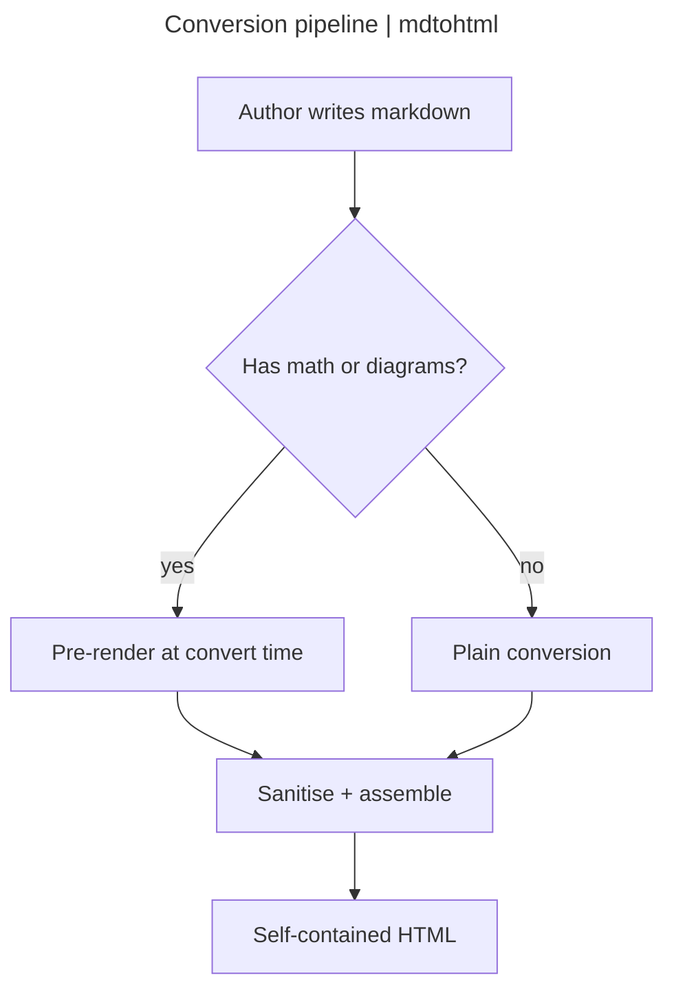
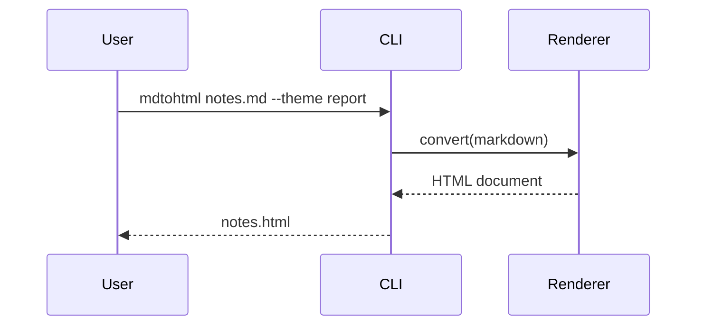
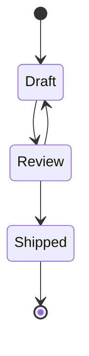
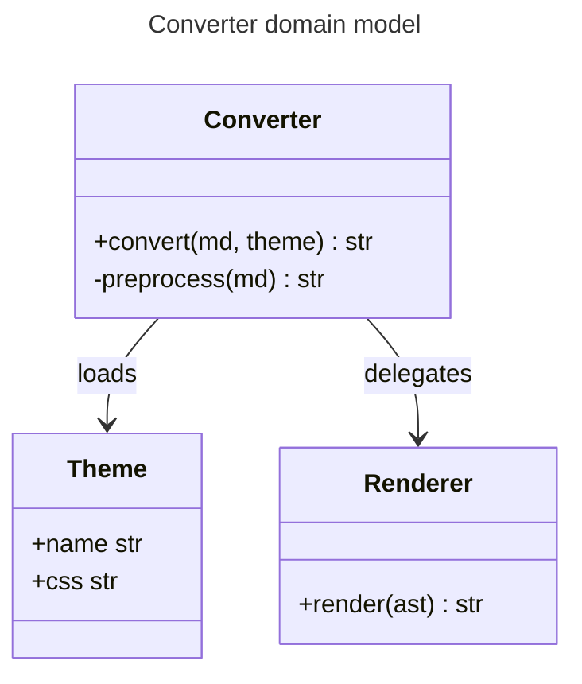
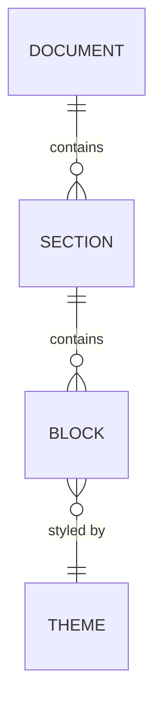
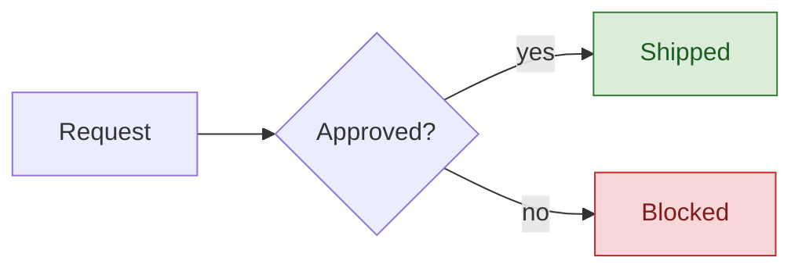
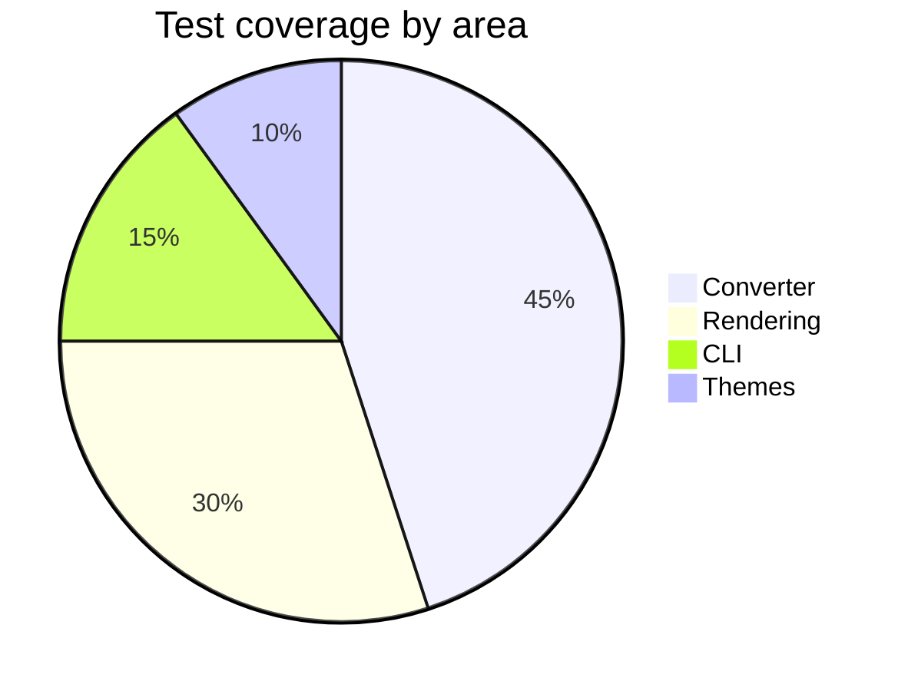
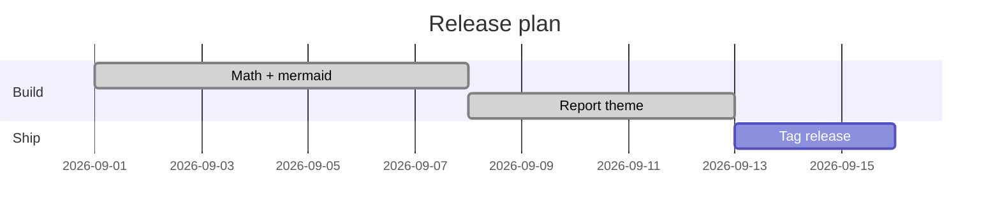
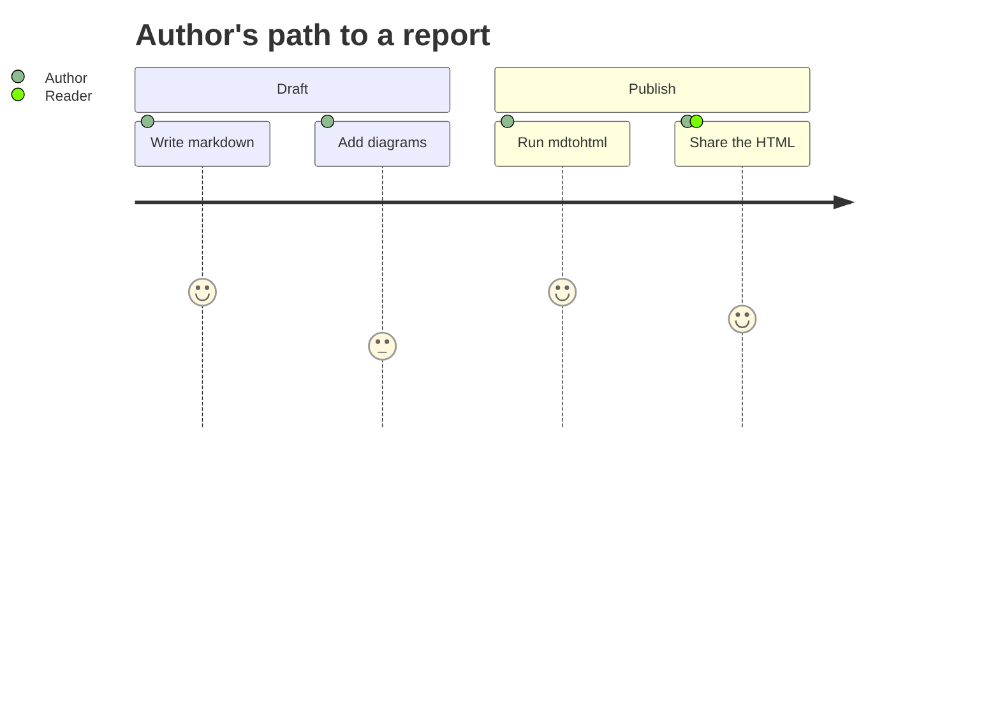

^ Legend
## Status legend

Coloured chips (`:key[label]`) render categorical pills in all eleven palette keys:
:green[shipped] :blue[in review] :amber[at risk] :red[blocked] :slate[deferred]
:purple[spike] :teal[docs] :pink[design] :lime[qa] :gold[release] :gray[backlog]

A section can lead with a `^ Label` kicker --- the small mono line above this and
the other headings on this page.

^ Formatting
## Text and inline formatting

Ordinary prose with **bold**, *italic*, `inline code`, ~~struck-through~~
text, and ==highlighted== phrases. A colon that is not a palette key stays
literal: the meeting is at `10:30`, and a ratio like `3:1` is untouched. An
inline chip mid-sentence reads :blue[in review] without disturbing the flow.

The same palette also colours bare text with no pill (`:key{label}`):
:blue{blue} :green{green} :amber{amber} :purple{purple} :teal{teal} :pink{pink}
:lime{lime} :gold{gold} :slate{slate} :red{red} :gray{gray}.

> A blockquote for a pulled-out remark. It is distinct from a callout and
> renders as a plain quotation.

Here is a footnote reference[^1], resolved at the foot of the page. And an
Obsidian wikilink to a sibling page: [[Architecture Overview]], one with
custom text [[Architecture Overview|the design doc]], and one to a heading
[[Architecture Overview#Data Flow]].

^ Headings
## Heading levels

The theme styles every heading level distinctly, even those below the
table-of-contents depth (which stops at `h3`).

### Level three

A third-level subsection --- listed in the sidebar, nested under its section.

#### Level four

A fourth-level heading: styled, but below the TOC depth so it stays out of the
sidebar.

##### Level five

A fifth-level heading, rendered as a small mono uppercase label.

###### Level six

A sixth-level heading, rendered in faint italic.

---

^ Callouts
## Callout cards

The `report` theme renders all fifteen Obsidian callout families as tinted cards
with a mono uppercase title; inline `code` inside each picks up its family tint.

> [!note] Note
> The `note` family wears the amber/rust accent, shared with `warning` and
> `important`.

> [!abstract] Abstract
> The `abstract` and `info` families share a teal accent for `summary` content.

> [!info] Info
> The `info` callout carries the same teal accent --- for `context` a reader
> needs but the section does not turn on.

> [!todo] Todo
> The `todo` and `example` families share a purple accent; use it for `pending`
> work.

> [!tip] Tip
> Callouts accept full markdown inside, including `code`, **emphasis**, and
> lists. The `tip` and `success` families share a green accent.

> [!success] Success
> The `success` callout is the green family's affirmative voice --- a passing
> `gate`, a landed change.

> [!question] Question
> The `question` family uses an olive accent for an open `decision` awaiting an
> answer.

> [!warning] Warning
> The warning callout uses an amber accent --- distinct from the red danger
> family --- with an AA-safe title in both light and dark colour schemes. Wrap a
> risky `flag` in it.

> [!important] Important
> The `important` callout rides the amber family with `warning`, so it never
> reads as danger.

> [!example] Example
> The `example` family shares the purple accent with `todo`; use it to frame a
> worked `snippet`.

> [!quote] Quote
> The `quote` family uses a slate accent for an attributed `citation`.

> [!bug] Bug
> The `bug` family uses a pink accent for a known `defect`.

> [!failure] Failure
> The `failure` and `danger` families keep the red accent, for a broken `build`
> or a failed check.

> [!danger] Danger
> The danger family keeps the red accent, for destructive or irreversible
> actions such as `rm -rf`.

> [!keypoint]
> A `keypoint` callout is a plain elevated card with no title --- for the one
> takeaway of a section. It can hold a pull quote:
>
> > Every other callout tints and labels itself; the keypoint stays quiet.

^ Lists
## Lists and tasks

Unordered:

- First item
- Second item, with a nested list
    - Nested one
    - Nested two
- Third item

Ordered:

1. Prepare the build
2. Run the full gate
3. Ship the release

Task list:

- [x] Pre-render math server-side
- [x] Pre-render mermaid diagrams
- [x] Aggregate third-party notices
- [ ] Tag the release

^ Data
## Tables

Tables are wrapped in a card. Under the `report` theme cells wrap to fit the
content column, falling back to scrolling within the card only when a viewport is
narrower than the table's floor width.

### A plain table

| Component | Owner | Coverage |
|-----------|-------|----------|
| Converter | core  | 92% |
| Rendering | core  | 88% |
| CLI       | core  | 95% |

### A keyed table with chips

A `{.keyed}` line above a table styles its first column as an accent key, and
status cells stay expressive with chips:

{.keyed}
| Component | Owner | Status | Notes |
|-----------|-------|--------|-------|
| Math (KaTeX SSR) | core | :green[shipped] | No JS engine in output |
| Mermaid diagrams | core | :green[shipped] | Inline SVG, `securityLevel: strict` |
| Report theme | ui | :blue[in review] | Auto light/dark |
| Matrix / legend fences | ui | :slate[deferred] | Out of this cut |
| Windows binary | build | :amber[at risk] | Needs a Windows runner |

^ Code
## Syntax-highlighted code

A plain fence highlights with no header card:

```python
from mdtohtml.converter import convert

html = convert(open("notes.md").read(), theme_name="report", toc=True)
```

A `title=` adds a header card. A single title is one left-aligned label:

```{.python title="converter.py"}
def convert(md: str, theme_name: str) -> str:
    ...
```

A `left | right` title splits across the header, and `hl_lines` bands the lines
under discussion (space-separated line numbers):

```{.python title="mdtohtml.converter | build()" hl_lines="5 6"}
from mdtohtml.converter import convert

def build(md: str) -> str:
    """Convert markdown to a self-contained HTML document."""
    doc = convert(md, theme_name="report", toc=True)
    return doc
```
~ The single entry point callers use; the two banded lines run and return the conversion.

^ Math
## Mathematics

Inline math flows in a sentence: the mass-energy relation is $E = mc^2$, and
Euler's identity is $e^{i\pi} + 1 = 0$.

Display math is centred on its own line:

$$
\int_0^\infty \frac{x^{s-1}}{e^{x} - 1}\,dx = \Gamma(s)\,\zeta(s)
$$

A matrix and a fraction:

$$
A = \begin{pmatrix} a & b \\ c & d \end{pmatrix}
\qquad
\frac{\partial}{\partial t}\,\Psi = \hat{H}\,\Psi
$$

^ Diagrams
## Diagrams

Every mermaid fence is pre-rendered to inline SVG at convert time --- no runtime
JavaScript, no network call.

### Structural diagrams

Structural diagrams (flowchart, sequence, state, class, ER) are recoloured to the
theme palette and adapt to dark mode.

A flowchart. Its `title:` front-matter field is lifted out of the canvas into the
card's header bar, and a `left | right` title splits across it:


~ A tilde-marker line renders a caption under the card, like this one.

A sequence diagram:



A state diagram:



A class diagram. Its `title:` here is a single label, so the header bar carries
one left-aligned title with no meta note:



An entity-relationship diagram:



A flowchart with author `classDef` colours. Each colour keeps its hue in light
mode and is retuned to a dark-friendly tone with an AA-legible label in dark mode:


~ classDef node colours adapt to the colour scheme, hue preserved.

### Categorical diagrams

Categorical diagrams (pie, gantt) keep their own hues and darken in dark mode.

A pie chart:



A gantt chart:



### Other diagram types

Any other mermaid family (here a user journey) is neither recoloured nor
darkened --- it keeps mermaid's own palette on a light card that stays legible in
dark mode:



^ Notes
## Notes

Everything above renders to one portable HTML file with no network calls. Math
and diagrams carry no runtime engine; the only JavaScript is the optional
table-of-contents sidebar (its scroll-spy and collapse toggle).

::: footer
Generated by **mdtohtml** with the `report` theme. A `::: footer` container ends
the page; a list inside it gets chevron bullets. Source components:

- converter.py
- themes/report.css
- mermaid_render.py
:::

[^1]: Footnotes are collected here and linked back to their references.
