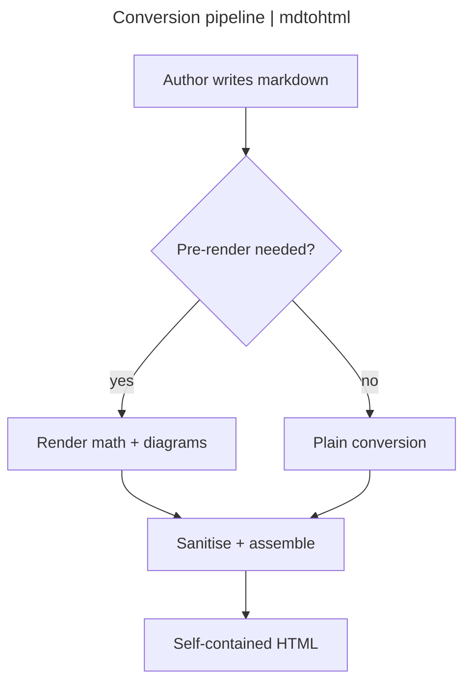

^ Front matter
## The report hero

A leading `---` block supplies the hero above: an `eyebrow` kicker, the `title`
(which also sets the document `<title>`), a `lede`, and up to a handful of `slot:`
cards split `label | heading | body`. The `lede` and slot fields accept inline
markdown. This block produced the header at the top of the page:

```markdown
---
eyebrow: mdtohtml · component reference
title: Release Readiness Report
lede: A one-paragraph intro that may carry **inline markdown**.
slot: Shipped | Server-side rendering | Zero runtime JavaScript.
slot: Themed | Report theme | Auto light/dark, AA-safe.
slot: Portable | Single file | Everything inlines into one HTML file.
---
```

^ Formatting
## Text and inline formatting

The inline span constructs and the block quote:

```markdown
Ordinary prose with **bold**, *italic*, `inline code`, ~~struck-through~~
text, and ==highlighted== phrases. Typographic dashes: en `--` and em `---`.

> A blockquote for a pulled-out remark, distinct from a callout.
```

Ordinary prose with **bold**, *italic*, `inline code`, ~~struck-through~~
text, and ==highlighted== phrases. Typographic dashes render an en-dash from `--`
and an em-dash from `---`; straight quotes and `...` are left as typed. A colon
that is not a palette key stays literal: the meeting is at `10:30`, and a ratio
like `3:1` is untouched.

> A blockquote for a pulled-out remark. It is distinct from a callout and
> renders as a plain quotation.

Footnotes and Obsidian wikilinks resolve to the `.html` sibling of each page:

```markdown
A footnote reference[^1]. A wikilink [[Architecture Overview]], one with custom
text [[Architecture Overview|the design doc]], and one to a heading
[[Architecture Overview#Data Flow]].
```

A footnote reference[^1], resolved at the foot of the page. A wikilink to a
sibling page: [[Architecture Overview]], one with custom text
[[Architecture Overview|the design doc]], and one to a heading
[[Architecture Overview#Data Flow]].

^ Colouring
## Chips and coloured text

An inline `:key[label]` renders a categorical pill; `:key{label}` renders bare
bold text in the same colour with no pill. A key outside the eleven-colour
palette, or one glued to a preceding word, is left literal.

```markdown
Chips: :green[shipped] :blue[in review] :amber[at risk]
Bare text: :green{yes} :red{no}
```

Chips in all eleven palette keys:
:green[shipped] :blue[in review] :amber[at risk] :red[blocked] :slate[deferred]
:purple[spike] :teal[docs] :pink[design] :lime[qa] :gold[release] :gray[backlog]

The same palette as bare coloured text:
:blue{blue} :green{green} :amber{amber} :purple{purple} :teal{teal} :pink{pink}
:lime{lime} :gold{gold} :slate{slate} :red{red} :gray{gray}.

An inline chip mid-sentence reads :blue[in review] without disturbing the flow.

^ Markers
## Section kickers and captions

A `^ Label` line immediately above a heading becomes a muted mono kicker leading
the section --- every heading on this page uses one. A `~ text` line becomes a
small faint caption, most useful directly under a diagram, code block, or table.

```markdown
^ The symptom
## What it reports

~ A caption sits under the block above it.
```

The `~` marker below renders as a caption:

~ A caption, tucked under the block above it.

^ Headings
## Heading levels

The theme styles every heading level distinctly, even those below the
table-of-contents depth (which stops at `h3`).

```markdown
## Section (h2)
### Subsection (h3)
#### Level four
##### Level five
###### Level six
```

### Level three

A third-level subsection, nested under its section in the sidebar.

#### Level four

A fourth-level heading, below the table-of-contents depth.

##### Level five

A fifth-level heading.

###### Level six

A sixth-level heading.

^ Callouts
## Callout cards

An Obsidian callout is `> [!type]` with optional continuation lines. The text
after the type is a title: omit it for the capitalised default, or write your own
to override it. A `keypoint` takes no title at all.

```markdown
> [!note]
> A default title (the capitalised type) and body with `code`.

> [!warning] Heads up
> A custom title --- any text after the type replaces the default.

> [!keypoint]
> No title: a plain elevated card for the one takeaway.
```

The `report` theme styles all fifteen families; inline `code` inside each picks
up its family tint.

> [!note] Note
> The `note` family wears the amber/rust accent, shared with `warning` and
> `important`.

> [!abstract] Abstract
> The `abstract` and `info` families share a teal accent for `summary` content.

> [!info] Info
> The `info` callout carries the same teal accent --- for `context` a reader
> needs but the section does not turn on.

> [!todo] Todo
> The `todo` and `example` families share a purple accent; use it for `pending`
> work.

> [!tip] Tip
> Callouts accept full markdown inside, including `code`, **emphasis**, and
> lists. The `tip` and `success` families share a green accent.

> [!success] Success
> The `success` callout is the green family's affirmative voice --- a passing
> `gate`, a landed change.

> [!question] Question
> The `question` family uses an olive accent for an open `decision` awaiting an
> answer.

> [!warning] Heads up
> A custom title in place of the default. The warning callout uses an amber
> accent --- distinct from the red danger family --- with an AA-safe title in
> both colour schemes. Wrap a risky `flag` in it.

> [!important] Important
> The `important` callout rides the amber family with `warning`, so it never
> reads as danger.

> [!example] Example
> The `example` family shares the purple accent with `todo`; use it to frame a
> worked `snippet`.

> [!quote] Quote
> The `quote` family uses a slate accent for an attributed `citation`.

> [!bug] Bug
> The `bug` family uses a pink accent for a known `defect`.

> [!failure] Failure
> The `failure` and `danger` families keep the red accent, for a broken `build`
> or a failed check.

> [!danger] Danger
> The danger family keeps the red accent, for destructive or irreversible
> actions such as `rm -rf`.

> [!keypoint]
> A `keypoint` callout is a plain elevated card with no title --- for the one
> takeaway of a section. It can hold a pull quote:
>
> > Every other callout tints and labels itself; the keypoint stays quiet.

^ Lists
## Lists and tasks

Unordered, ordered, and task lists all line their text up on one left edge:

```markdown
- First item
- Second item, with a nested list
    - Nested one
    - Nested two

1. Prepare the build
2. Run the full gate
3. Ship the release

- [x] A completed task
- [ ] An open task
```

Unordered:

- First item
- Second item, with a nested list
    - Nested one
    - Nested two
- Third item

Ordered:

1. Prepare the build
2. Run the full gate
3. Ship the release

Task list:

- [x] Pre-render math server-side
- [x] Pre-render mermaid diagrams
- [x] Aggregate third-party notices
- [ ] Tag the release

^ Tables
## Tables

Tables render inside a card, wrapping to fit the content column.

### A plain table

```markdown
| Component | Owner | Coverage |
|-----------|-------|----------|
| Converter | core  | 92% |
| Rendering | core  | 88% |
```

| Component | Owner | Coverage |
|-----------|-------|----------|
| Converter | core  | 92% |
| Rendering | core  | 88% |
| CLI       | core  | 95% |

### A keyed table with chips

A `{.keyed}` line above a table styles its first column as an accent key, and
status cells stay expressive with chips:

```markdown
{.keyed}
| Component | Owner | Status |
|-----------|-------|--------|
| Math (KaTeX SSR) | core | :green[shipped] |
| Report theme | ui | :blue[in review] |
```

{.keyed}
| Component | Owner | Status | Notes |
|-----------|-------|--------|-------|
| Math (KaTeX SSR) | core | :green[shipped] | No JS engine in output |
| Mermaid diagrams | core | :green[shipped] | Inline SVG, `securityLevel: strict` |
| Report theme | ui | :blue[in review] | Auto light/dark |
| Matrix / legend fences | ui | :slate[deferred] | Out of this cut |
| Windows binary | build | :amber[at risk] | Needs a Windows runner |

^ Code
## Syntax-highlighted code

A plain fence highlights with no header card:

````markdown
```python
from mdtohtml.converter import convert

html = convert(open("notes.md").read(), theme_name="report", toc=True)
```
````

```python
from mdtohtml.converter import convert

html = convert(open("notes.md").read(), theme_name="report", toc=True)
```

A `title=` adds a header card. A single title is one left-aligned label:

````markdown
```{.python title="converter.py"}
def convert(md: str, theme_name: str) -> str:
    ...
```
````

```{.python title="converter.py"}
def convert(md: str, theme_name: str) -> str:
    ...
```

A `left | right` title splits across the header, and `hl_lines` bands the lines
under discussion (space-separated line numbers):

````markdown
```{.python title="mdtohtml.converter | build()" hl_lines="5 6"}
from mdtohtml.converter import convert

def build(md: str) -> str:
    """Convert markdown to a self-contained HTML document."""
    doc = convert(md, theme_name="report", toc=True)
    return doc
```
````

```{.python title="mdtohtml.converter | build()" hl_lines="5 6"}
from mdtohtml.converter import convert

def build(md: str) -> str:
    """Convert markdown to a self-contained HTML document."""
    doc = convert(md, theme_name="report", toc=True)
    return doc
```

^ Math
## Mathematics

Inline math uses single `$` delimiters and display math uses `$$`:

```markdown
The relation is $E = mc^2$.

$$
\int_0^\infty \frac{x^{s-1}}{e^{x} - 1}\,dx = \Gamma(s)\,\zeta(s)
$$
```

Inline math flows in a sentence: the mass-energy relation is $E = mc^2$, and
Euler's identity is $e^{i\pi} + 1 = 0$.

Display math is centred on its own line:

$$
\int_0^\infty \frac{x^{s-1}}{e^{x} - 1}\,dx = \Gamma(s)\,\zeta(s)
$$

A matrix and a fraction:

$$
A = \begin{pmatrix} a & b \\ c & d \end{pmatrix}
\qquad
\frac{\partial}{\partial t}\,\Psi = \hat{H}\,\Psi
$$

^ Diagrams
## Diagrams

A `mermaid` fenced code block is pre-rendered to inline SVG at convert time ---
no runtime JavaScript, no network call. See mermaid's own docs for the diagram
types and their syntax; what the `report` theme adds is the framing.

Set a `title:` in the diagram's front matter and it is lifted out of the canvas
into the card's header bar. A `left | right` title splits into a left label and a
right-aligned meta note; a single label (no `|`) renders as one left-aligned
title.

````markdown

````


The theme recolours structural diagrams (flowchart, sequence, state, class, ER)
to its palette and adapts author `classDef` colours to dark mode, keeps
categorical diagrams (pie, gantt) on their own hues, and leaves any other family
on a plain card --- all following the reader's colour scheme.

^ Images
## Images

An image embedded as a `data:` URI travels inside the HTML, so the page stays
self-contained --- no separate asset, no network fetch. Only image MIME types
are allowed, and only as an image (never as a link target). Wrap it in a figure
with a caption using the caption marker:

```markdown


~ Throughput sampled across one conversion run.
```

![Lines converted per stage](data:image/svg+xml;base64,PHN2ZyB4bWxucz0iaHR0cDovL3d3dy53My5vcmcvMjAwMC9zdmciIHdpZHRoPSI1MjAiIGhlaWdodD0iMTgwIiB2aWV3Qm94PSIwIDAgNTIwIDE4MCIgcm9sZT0iaW1nIiBhcmlhLWxhYmVsPSJCYXIgY2hhcnQgb2YgbGluZXMgY29udmVydGVkIHBlciBzdGFnZSI+CjxyZWN0IHg9IjAiIHk9IjAiIHdpZHRoPSI1MjAiIGhlaWdodD0iMTgwIiByeD0iMTIiIGZpbGw9IiNmN2YyZTkiLz4KPHRleHQgeD0iMjQiIHk9IjM0IiBmb250LWZhbWlseT0iR2VvcmdpYSwgc2VyaWYiIGZvbnQtc2l6ZT0iMTYiIGZpbGw9IiM0YTNiMjQiPkxpbmVzIGNvbnZlcnRlZCBwZXIgc3RhZ2U8L3RleHQ+CjxnIGZvbnQtZmFtaWx5PSJIZWx2ZXRpY2EsIEFyaWFsLCBzYW5zLXNlcmlmIiBmb250LXNpemU9IjEyIiBmaWxsPSIjNmI1YTNlIj4KPHJlY3QgeD0iMTQwIiB5PSI1NCIgd2lkdGg9IjMwMCIgaGVpZ2h0PSIxOCIgcng9IjQiIGZpbGw9IiNiMDZhMmMiLz48dGV4dCB4PSIyNCIgeT0iNjciPlBhcnNlPC90ZXh0Pjx0ZXh0IHg9IjQ0OCIgeT0iNjciIGZpbGw9IiM0YTNiMjQiPjMwMDwvdGV4dD4KPHJlY3QgeD0iMTQwIiB5PSI4NiIgd2lkdGg9IjIyMCIgaGVpZ2h0PSIxOCIgcng9IjQiIGZpbGw9IiM1YzdhNTIiLz48dGV4dCB4PSIyNCIgeT0iOTkiPlJlbmRlcjwvdGV4dD48dGV4dCB4PSIzNjgiIHk9Ijk5IiBmaWxsPSIjNGEzYjI0Ij4yMjA8L3RleHQ+CjxyZWN0IHg9IjE0MCIgeT0iMTE4IiB3aWR0aD0iMTYwIiBoZWlnaHQ9IjE4IiByeD0iNCIgZmlsbD0iIzNmNmI4NiIvPjx0ZXh0IHg9IjI0IiB5PSIxMzEiPlNhbml0aXNlPC90ZXh0Pjx0ZXh0IHg9IjMwOCIgeT0iMTMxIiBmaWxsPSIjNGEzYjI0Ij4xNjA8L3RleHQ+CjxyZWN0IHg9IjE0MCIgeT0iMTUwIiB3aWR0aD0iOTAiIGhlaWdodD0iMTgiIHJ4PSI0IiBmaWxsPSIjN2E1YTg2Ii8+PHRleHQgeD0iMjQiIHk9IjE2MyI+QXNzZW1ibGU8L3RleHQ+PHRleHQgeD0iMjM4IiB5PSIxNjMiIGZpbGw9IiM0YTNiMjQiPjkwPC90ZXh0Pgo8L2c+Cjwvc3ZnPg==)

~ Throughput sampled across one conversion run.

Remote images work too (``), but a `data:` URI is what keeps
the single-file output truly portable.

^ Footer
## Document footer

A `::: footer` container ends the page; a list inside it gets accent chevron
bullets, and the body is ordinary Markdown:

```markdown
::: footer
Generated by **mdtohtml** with the `report` theme.

- converter.py
- themes/report.css
:::
```

::: footer
Generated by **mdtohtml** with the `report` theme.

- converter.py
- themes/report.css
- mermaid_render.py
:::

[^1]: Footnotes are collected here and linked back to their references.
