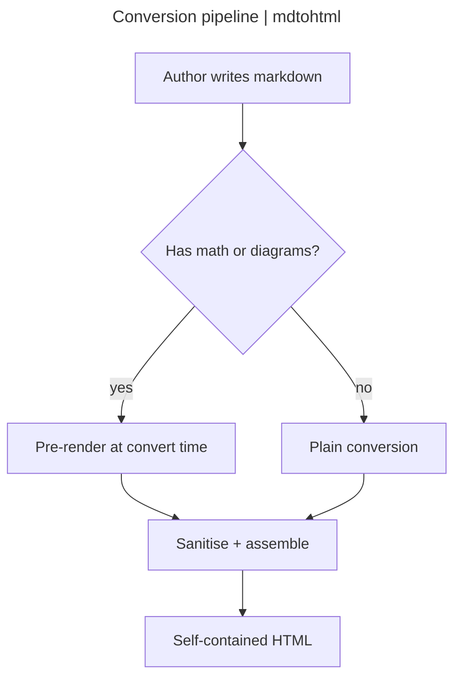
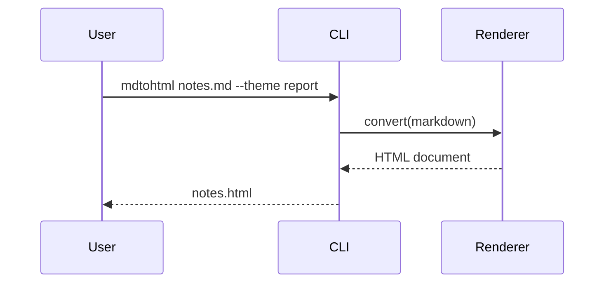
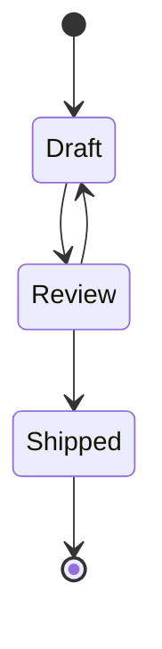
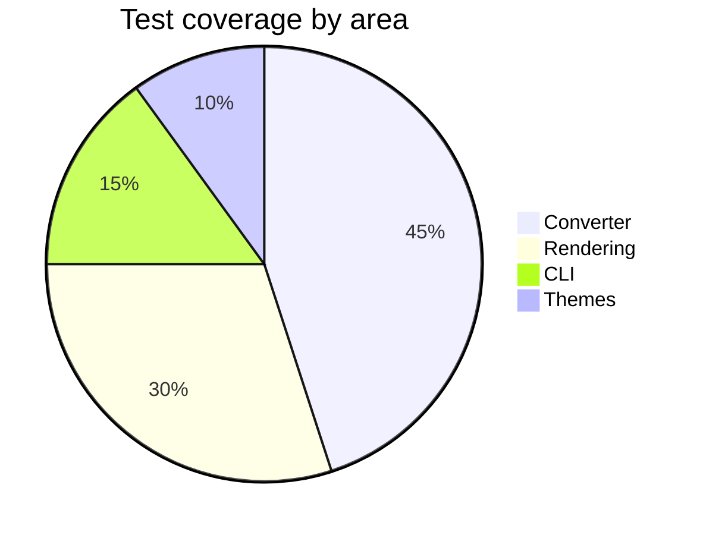
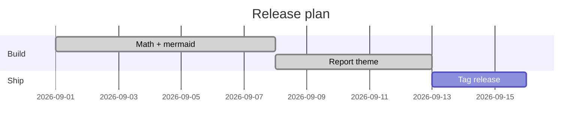

## Status legend

Status legend: :green[shipped] :blue[in review] :amber[at risk]
:red[blocked] :slate[deferred] :purple[spike] :teal[docs] :pink[design]
:lime[qa] :gold[release] :gray[backlog]

## Text and inline formatting

Ordinary prose with **bold**, *italic*, `inline code`, ~~struck-through~~
text, and ==highlighted== phrases. A colon that is not a palette key stays
literal: the meeting is at `10:30`, and a ratio like `3:1` is untouched. An
inline chip mid-sentence reads :blue[in review] without disturbing the flow.

> A blockquote for a pulled-out remark. It is distinct from a callout and
> renders as a plain quotation.

Here is a footnote reference[^1], resolved at the foot of the page. And an
Obsidian wikilink to a sibling page: [[Architecture Overview]], one with
custom text [[Architecture Overview|the design doc]], and one to a heading
[[Architecture Overview#Data Flow]].

---

## Callout cards

> [!note] Note
> The `report` theme renders Obsidian callouts as tinted cards with a mono
> uppercase title.

> [!tip] Tip
> Callouts accept full markdown inside, including `code`, **emphasis**, and
> lists.

> [!warning] Warning
> The warning callout uses an amber accent -- distinct from the red danger
> family -- with an AA-safe title in both light and dark colour schemes.

> [!danger] Danger
> The danger and failure family keeps the red accent, for destructive or
> irreversible actions.

## Lists and tasks

Unordered:

- First item
- Second item, with a nested list
    - Nested one
    - Nested two
- Third item

Ordered:

1. Prepare the build
2. Run the full gate
3. Ship the release

Task list:

- [x] Pre-render math server-side
- [x] Pre-render mermaid diagrams
- [x] Aggregate third-party notices
- [ ] Tag the release

## A data table with chips

| Component | Owner | Status | Notes |
|-----------|-------|--------|-------|
| Math (KaTeX SSR) | core | :green[shipped] | No JS engine in output |
| Mermaid diagrams | core | :green[shipped] | Inline SVG, `securityLevel: strict` |
| Report theme | ui | :blue[in review] | Auto light/dark |
| Matrix / legend fences | ui | :slate[deferred] | Out of this cut |
| Windows binary | build | :amber[at risk] | Needs a Windows runner |

## Syntax-highlighted code

```python
from mdtohtml.converter import convert

def build(md: str) -> str:
    """Convert markdown to a self-contained HTML document."""
    return convert(md, theme_name="report", toc=True)
```

## Mathematics

Inline math flows in a sentence: the mass-energy relation is $E = mc^2$, and
Euler's identity is $e^{i\pi} + 1 = 0$.

Display math is centred on its own line:

$$
\int_0^\infty \frac{x^{s-1}}{e^{x} - 1}\,dx = \Gamma(s)\,\zeta(s)
$$

A matrix and a fraction:

$$
A = \begin{pmatrix} a & b \\ c & d \end{pmatrix}
\qquad
\frac{\partial}{\partial t}\,\Psi = \hat{H}\,\Psi
$$

## Diagrams

A flowchart. Its `title:` front-matter field is lifted out of the canvas into
the card's header bar, and a `left | right` title splits across it:



A sequence diagram:



A state diagram:



A pie chart (categorical - keeps its own hues, darker in dark mode):



A gantt chart (categorical):



## Notes

Everything above renders to one portable HTML file with no network calls. Math
and diagrams carry no runtime engine; the only JavaScript is the optional
table-of-contents sidebar (its scroll-spy and collapse toggle).

[^1]: Footnotes are collected here and linked back to their references.
